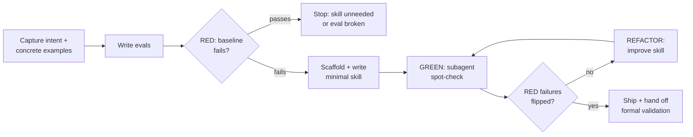

# Create Skill

Create skills the way disciplined engineers create code: evidence first, minimal content, a flipped baseline as the shipping gate.

**Creating a skill IS test-driven development applied to process documentation.** Write the eval, watch the baseline agent fail (RED), write the minimal skill that flips it (GREEN), close the loopholes evaluation exposes (REFACTOR). If you didn't watch an agent fail without the skill, you don't know that the skill teaches anything.

**The Iron Law, tiered:**
- **Behavioral change** (new skill, new rule, changed guidance): requires a failing baseline BEFORE the content is written. An eval the baseline already passes proves the skill is unnecessary or the eval is broken.
- **Mechanical edit** (typo, path fix, formatting): requires re-running the existing eval suite after the edit. No new baseline needed.

Structure and budget rules: `references/skill-anatomy.md`. Writing rules: `references/writing-guide.md`. Evaluation machinery: the **eval-skill** skill — this workflow invokes it rather than duplicating it.

## CLI resolution (once per session)

There is no launcher script — resolving the CLI is your job, once, before the first command. From the create-skill skill root:

```text
1. bin/ holds this platform's compiled binary?  ->  use that path
     macOS:    bin/create-skill-darwin-arm64
     Linux:    bin/create-skill-linux-x64
     Windows:  bin/create-skill-windows-x64.exe
2. no binary for this platform:  the CLI is unavailable -- report that
     and stop; never improvise a substitute
```

Every `create-skill …` command below means the command resolved here.

This document also issues `eval-skill …` commands (steps 3, 6, 8) — a different
binary. Resolve those once through the eval-skill skill's own § CLI resolution;
invoke that skill rather than guessing a path. An unresolvable command is a stop,
not a licence to improvise: an in-session subagent is not a substitute for a
hermetic `eval-skill` run, and step 3 depends on that distinction.

## When to create a skill — and when not

Create when the technique wasn't intuitively obvious, would be referenced again across projects, and applies broadly. Don't create for one-off solutions, standard practices already well-documented, project-specific conventions (those belong in the project's instructions file), or anything enforceable by a validator/regex — automate mechanical constraints; save documentation for judgment calls.

Two safety rules regardless of type: handle bundled scripts and external actions according to their risk — an operation that can be destructive or irreversible gets a plan → validate → execute → verify structure, never a bare command. And never create a skill whose behavior would surprise its user: no concealed side effects, no undisclosed data flows, nothing that facilitates unauthorized access.

**Skill types** (drives both writing form and eval design):

| Type | What it is | Eval focus |
|------|-----------|------------|
| Technique | Concrete method with steps | Application to new scenarios |
| Pattern | A way of thinking about problems | Recognition + counter-examples |
| Reference | API docs, schemas, tool guides | Retrieval + correct application |
| Discipline | Rules with compliance costs | Pressure scenarios |
| Tool | Bundled scripts/APIs are the contract | Resource scenarios (script runs correctly on real input AND fails safely on bad input; agent uses the bundled script rather than reimplementing it) |

## The workflow



### 1. Capture intent

Inspect before asking: read the conversation, the target directory, any existing skill being revised, and neighboring skills' descriptions — trigger collisions are cheapest to catch here. If the conversation already contains the workflow ("turn this into a skill"), extract from history first — tools used, step sequence, corrections made, formats observed — and have the user confirm. Ask only what is both undiscoverable and consequential, a few questions at a time:

1. What should this skill enable the agent to do?
2. When should it trigger — what would a user actually type?
3. What near-miss requests should NOT trigger it? (These become the trigger suite's negatives.)
4. What's the expected output format, and what constraints bind it (safety, compatibility, latency, side effects)?
5. Are outputs objectively verifiable (file transforms, data extraction, fixed steps) or subjective (writing style, design)? Verifiable outputs get assertions; subjective outputs get human review and blind A/B — never zero evaluation.

Research edge cases, input formats, and dependencies before writing anything. Classify the skill type (table above).

### 2. Concrete examples → the eval corpus

Collect 3+ concrete example requests — realistic, specific, the kind of thing a user would actually type. Then extract two artifacts from them:

- **Bundled-resource plan:** for each example, mentally execute it from scratch and ask what would be re-written or re-discovered every time (see skill-anatomy.md § resource types). That's what to bundle.
- **The eval seed corpus:** write the examples into the skill's runbook — `runbooks/<skill-name>.yaml` at the repo root, holding the run definition plus `evals[]`/`trigger_evals[]` (contract: the schemas reference in eval-skill; design rules: the scenario-design reference in eval-skill). Scaffold the file with `eval-skill init-runbook` rather than hand-rolling the YAML — the `init-eval-infra` skill choreographs it together with the discovery-root mounts. The suite lives in the repo's `runbooks/`, never inside the skill directory. The examples that define the skill are the evals that test it — gathering examples and never testing against them wastes the best evidence available.

### 3. RED: run the baseline

Before writing any skill content, run the eval prompts against the baseline configuration via eval-skill's Tier 2 harness — `eval-skill run-behavioral --configuration without_skill`, one hermetic run per eval: fresh sandbox, empty discovery root, `--safe-mode`, so the baseline is provably skill-free in a way no in-session subagent can be. No skill for a new skill; a snapshot of the current version when improving an existing one. This is the authoring flow's one deliberate headless-CLI expense, and it is paid once per eval, not once per iteration — the loop that follows never re-runs a baseline it already has.

- Document failures and rationalizations **verbatim**. These are the specification: the skill's job is to fix exactly these.
- For discipline skills, the baseline runs are pressure scenarios (eval-skill Tier 3) — the captured rationalizations become the skill's rationalization table.
- **A baseline that passes stops the project.** Either the skill isn't needed (the model already does this) or the eval is non-discriminating. Fix the eval or abandon the skill; don't write content for a problem that doesn't reproduce.

### 4. Scaffold and build resources first

`create-skill` commands in this document run from the create-skill skill
root, spelled with the resolved command from § CLI resolution.

```bash
create-skill init-skill <skill-name> --path <parent-dir> [--resources scripts,references,assets]
```

Decide the target platform profile (`portable` / `claude` / `codex` / `both`) before scaffolding — rules: `references/platform-compatibility.md`. When the user hasn't named a destination, default to the repo's canonical skills directory (`<repo>/skills/<name>`) mounted into each target platform's discovery root with relative symlinks — `.claude/skills/<name>` for Claude Code, `.agents/skills/<name>` for Codex; validate the mounts with `create-skill validate-mounts --repo-root <repo>` (pass --fix to create missing links). Installs are repo-level, not user-home level: the skill ships with the repo it serves.

When the working directory resolves to no repo — not a git repository, or no canonical `skills/` to mount into — that default has no referent, and `~/.claude/skills/` is the one destination it must never silently become. A home install strands the skill outside the repo that serves it and leaves steps 2 and 3 with no `runbooks/` to write into, so one wrong destination silently voids the entire RED chain. Establish the repo shape in the working directory instead — `skills/`, `runbooks/`, and both discovery roots, which the `init-eval-infra` skill scaffolds — or, when the working directory is genuinely not the skill's home, ask. Either way, state the destination you chose before scaffolding.

Then implement bundled resources BEFORE writing SKILL.md — a body written first tends to reference files that never get created. Test every script by actually running it (quality bar: writing-guide.md § Bundled script quality). The scaffold's TODO placeholders are enforced: eval-skill's Tier 0 lint fails on any leftovers.

### 5. GREEN: write the minimal skill

Write SKILL.md addressing the specific baseline failures documented in RED — nothing speculative (YAGNI applies to documentation). Follow `references/writing-guide.md` for the description (third person, capability + triggers, never a workflow summary) and body (imperative, explain-the-why, one excellent example), and `references/skill-anatomy.md` for structure and budgets.

Match the guidance form to the observed failure type (writing-guide.md § Match the form to the failure) — the baseline evidence tells you whether you need a recipe, a required slot, a conditional, or a prohibition with counters.

### 6. Spot-check: did the skill flip the RED failures?

Run Tier 0 (`eval-skill validate-skill` — local, seconds). Then re-run the eval prompts as fresh subagents with the skill now mounted — all fanned out in one turn, each given the eval's `prompt` and nothing else (blinding is a discipline here: never the runbook, expectations, or a sibling's output). Judge each output against the runbook's `expectations` and the verbatim RED record: GREEN is every documented baseline failure flipped. A run that fails because the skill never triggered is evidence too — of a description problem (step 8), not a content problem. For discipline skills, spot-check the pressure prompts the same way and capture new rationalizations verbatim.

**This loop is deliberately informal, and that is its speed.** No paired runs, no run dirs, no grading processes, no report — subagent-fast, zero headless-CLI spawns, and honest about being an unmeasured upper bound (the author judges; the subagents share this session's environment). It answers the only authoring-time question — does the draft fix what RED documented? — and nothing else. Formal measurement (Tier 1 trigger rates, paired hermetic runs, headless grading, `report.html`) is one runbook execution away whenever wanted — trigger measurement on request in step 8, everything else through step 9's hand-off — and never runs per-iteration.

### 7. REFACTOR: improve from evidence

Improve based on spot-check results and human feedback, then re-run step 6:

- **Generalize from feedback; don't overfit.** The skill will run against thousands of prompts, not the 3 test cases. Instead of fiddly case-specific patches or ever-more-constrictive MUSTs, try a different metaphor, a stronger leading word (writing-guide.md § Leading words), or a different working pattern — cheap to test, occasionally great.
- **Keep it lean.** Read the run outputs, not just your pass/fail judgment: cut instructions that send the model on unproductive detours. Content must earn its tokens.
- **Bundle repeated work.** Test runs independently writing the same helper script = that script belongs in `scripts/`.
- **An eval added or rewritten mid-loop gets its hermetic baseline run the moment it lands** — step 3's discipline is per-eval, not per-project; an eval with no failing baseline proves nothing when it passes.
- **For discipline skills:** consume the rationalizations captured by the pressure spot-checks (or by Tier 3, once a formal run exists). Every captured excuse gets the four-part fix — explicit negation, rationalization-table row, red-flag entry, description symptom (writing-guide.md § Bulletproofing). When an agent read the skill and still violated, use eval-skill's meta-testing protocol to classify the fix as principle, wording, or organization.
- When an agent fails an eval, fix the skill — never weaken the eval.

Stop iterating when: the user is satisfied, all review feedback comes back empty, or two consecutive iterations show no meaningful movement (report raw counts, not vibes).

### 8. Optimize the description (optional but recommended)

After content stabilizes, run eval-skill's Tier 1 trigger measurement; if triggering is weak, use its description-optimization loop (`run-loop` — train/test split, held-out selection). This is a headless-CLI sweep — the first spawn cost since RED — so run it when the description is worth measuring, with the user's go-ahead. Curate the query set with the user first. Never hand-inflate the description with pushy phrasing instead — measured precision/recall or nothing.

### 9. Ship

Ship on authoring evidence, labeled as exactly that: Tier 0 zero FAILs, the RED baseline documented, every documented failure flipped in step 6's spot-check, pressure prompts held (discipline skills). That evidence is spot-checked, not measured — report it with raw counts and never present it as a passed gate or a benchmark.

**Formal validation is the user's move, not this loop's tail.** The runbook from step 2 makes it one ask away — "run the runbook" hands the full pipeline (paired hermetic runs, headless grading, trigger measurement, `report.html`) to eval-skill's choreography, which dispatches a fresh subagent to execute it end-to-end. On scaffold dials (`executor: subagent`, `runs_per_configuration: 1`) that first measured run stays cheap and directional; when the user wants gate-closing numbers (a publish-grade "proven better", a regression gate, a repo's gating suite), tighten both dials in one edit — `executor: cli`, `runs_per_configuration` ≥ 3 — and only that run may close a gate (why the loose dials can't: quality-standards.md § Shipping bar and § Execution-carrier rules). State this hand-off when shipping; run nothing unasked.

Once the bar is met:

```bash
create-skill package-skill <path-to-skill>   # produces a .skill file, when packaging is wanted
```

Pass `--platform <darwin-arm64|linux-x64|windows-x64>|all` to compile and inject a standalone binary for that platform into the `.skill` instead of raw TypeScript source (writes `<skill-name>-<platform>.skill`); `--entry` overrides the default CLI entry point for a skill living outside this repo's own `src/` layout.

The runbook (`runbooks/<skill-name>.yaml`) stays in the repo alongside the skill — it is the regression suite future edits re-run.

Shipping hands back, it doesn't push forward: never publish, install globally, or delete source material (pre-consolidation skills, extracted conversation notes) unless the user asks; commit with the user's go-ahead, not by default.

**Sharing with Codex:** generate the `agents/openai.yaml` UI-metadata sidecar with `create-skill generate-openai-yaml <skill-dir> --interface ...` (field rules: `references/openai-yaml.md`). The sidecar ships inside the skill; the body stays platform-neutral (policy: `references/openai-yaml.md`; portable-core rules: `references/platform-compatibility.md`). For a repo-scoped `both` profile, re-run `create-skill validate-mounts` after shipping so both discovery roots provably resolve to the same canonical source.

**One skill at a time.** Complete this entire workflow — through step 9's ship — before starting the next skill. Batching skills means shipping untested skills.

## Revising or consolidating existing skills

The same workflow applies — the deltas are in what counts as RED's baseline and what must be preserved:

**Revision discipline.** Snapshot the current version outside the target directory before the first edit — the snapshot doubles as the Tier 2 baseline. Preserve the skill's name and its supported behavior unless the user explicitly asks for a breaking change. If the skill has no eval suite yet, backfill one first: turn its observed current behavior into regression cases BEFORE editing, so the revision has something to hold it steady.

**Consolidation (N skills → one).** Build an instruction-ownership map outside the target before drafting: every source capability, resource, and runtime directive maps to exactly one destination. The source skills are the baseline configuration; their evals seed the merged suite; their should-trigger queries must still trigger the merged skill unless a narrowing was deliberate. After drafting, walk the map to verify coverage and cut paraphrased restatements — near-duplicate guidance surviving a merge is how skills bloat. The map is working material: it never ships inside the skill.

## Rationalizations for skipping evaluation

| Excuse | Reality |
|--------|---------|
| "The skill is obviously clear" | Clear to the author ≠ clear to a fresh agent. That's what the eval measures. |
| "It's just a reference skill" | References have gaps and stale sections. Retrieval evals find them. |
| "Evaluation is overkill for this" | Untested skills fail in production, where debugging costs 10× the eval. |
| "I'll evaluate if problems emerge" | Problems = agents silently doing the wrong thing. Nobody files a bug. |
| "The baseline obviously fails" | Then demonstrating it costs one run. Skipping it costs the evidence for every later decision. |
| "Formal eval is deferred anyway, so skip the baseline too" | The hand-off defers *measurement*, not *evidence of need*. RED is the specification — a few hermetic runs, paid once. Content written without a failing baseline is speculation. |
| "No time to test" | The eval corpus already exists — it's the examples from step 2. Running it is the cheap part. |

## Checklist

**RED**
- [ ] Intent captured; skill type classified; verifiability decided
- [ ] 3+ concrete examples collected and written into the runbook (`runbooks/<skill-name>.yaml`)
- [ ] Baseline runs executed; failures/rationalizations documented verbatim
- [ ] Baseline actually fails (otherwise: stop)

**GREEN**
- [ ] Scaffolded with `create-skill init-skill`; resources built and scripts executed before body written
- [ ] Description: third person, capability + triggers, no workflow summary, no pushiness
- [ ] Body: imperative, explains why, one excellent example, within budgets, no leftover TODO placeholders
- [ ] Guidance form matches the baseline failure type
- [ ] Tier 0 zero FAILs; spot-check run: every documented RED failure flipped; pressure prompts held (discipline skills)

**REFACTOR**
- [ ] Human review feedback consumed; improvements generalize rather than overfit
- [ ] New rationalizations countered (four-part fix); re-run until no new ones appear
- [ ] Evals added or rewritten mid-loop received their hermetic baseline run
- [ ] Run outputs read; dead-weight instructions removed; repeated helper work bundled

**Ship**
- [ ] Authoring evidence reported as spot-checked, with raw counts and no gate language; formal-validation hand-off stated (how to run the runbook, when to tighten the dials); trigger measurement run or explicitly deferred
- [ ] If the user asked for gate-closing evidence: certification run executed with `executor: cli` and `runs_per_configuration` ≥ 3 — subagent or n=1 numbers never presented as a closed gate
- [ ] the runbook is committed in the repo's `runbooks/`; skill packaged if wanted; committed with the user's go-ahead
- [ ] THIS skill fully shipped before the next one starts

## Bundled files

- `bin/create-skill-<platform>` — compiled CLI binary, present only in a published package (§ CLI resolution; a dev checkout has no `bin/` and runs the repo's TypeScript source under Bun)
- `references/skill-anatomy.md` — structure, naming, progressive-disclosure budgets, resource taxonomy
- `references/writing-guide.md` — description/body writing rules, structure selection, form-matching, bulletproofing, script quality
- `references/platform-compatibility.md` — platform profiles, portable-core rules, repo dual-mount layout; read before creating a shared Codex/Claude skill
- `references/openai-yaml.md` — Codex sidecar field rules; read before generating or editing `agents/openai.yaml`

### `create-skill` subcommands

- `init-skill` — scaffold a new skill directory (template with lint-enforced TODO placeholders)
- `package-skill` — validate and package a finished skill into a `.skill` file
- `generate-openai-yaml` — platform adapter: generate the Codex `agents/openai.yaml` sidecar
- `validate-mounts` — verify repo-level dual-platform symlink mounts (`.claude/skills`, `.agents/skills`) resolve to the canonical skill

Zero-dependency TypeScript, run through `create-skill <subcommand> ...` (Bun ≥1.3 when running from repo source) — no separate install step, no Python.

REQUIRED SUB-SKILL: **eval-skill** — owns all evaluation machinery (lint, trigger tests, paired benchmarks, pressure tests, judge agents, schemas, viewer) plus the quality-standards rulebook this workflow ships against. If eval-skill is not available in the environment, say so and stop at a draft — a defined-but-unexecuted eval is not evidence, and authoring confidence is not a shipping gate.
